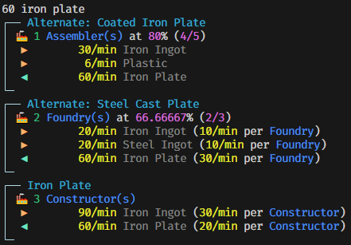

# ficsit-math

This tool is designed to help you plan and optimize your production in [Satisfactory](https://www.satisfactorygame.com/) by providing detailed breakdowns of the resources and machines required for any given production target:



---

⚠ Make sure your terminal supports color and unicode output!

E.g. the default `cmd.exe` in Windows 10 does **not**. For Windows 10 I strongly recommend using [Windows Terminal](https://aka.ms/terminal), which is the default on Windows 11.

---

⚠ I was a bit lazy with error handling...

Expect some crashes here and there for invalid inputs. I might get around at improving this at some point.

## Features

- 🏭 **Machine Requirements**: Calculates number of machines needed per target amount/min.
- ⚡ **Overclocking Details**: Calculates overclocking to optimize power consumption.
- 📦 **Item & Fluid Support**: Handles both solid items and fluids.
- 🔍 **Ingredient Search**: Find recipes by product or ingredient.
- 🎨 **Colored Output**: Provides clear and colorful terminal output.
- 🌐 **Localization**: Supports all in-game languages via [community resources](https://satisfactory.wiki.gg/wiki/Community_resources).

## Usage

1. Create a `.env` file next to the executable:

    ```sh
    SATISFACTORY_DOCS_PATH = "/path/to/Satisfactory/CommunityResources/docs/en-US.json"
    ```

    Feel free to use other languages. General program output will remain english, but item, fluid, recipe and machine names will be localized. (Including the item names that you type yourself!)

2. **Input the Desired Production**:
   - Enter the target production rate followed by the item name; e.g. `60 Iron Plate`
   - Use negative amounts to search for recipes where the item is an ingredient; e.g. `-30 Iron Ingot`

3. **Adjust Ratios**:
   - Multiply the ratio of the last prompt by entering `* 2` or divide it by entering `/ 3`.

4. **Exit**: Use `Ctrl+C` or `Ctrl+Z` to exit.

## Contributing

This was mostly a small toy project to me since I got annoyed at the laggy mess that [Satsifactory Calculator](https://satisfactory-calculator.com/en/planners/production) is, but contributions are welcome! Feel free to open issues or submit pull requests.

## License

This project is licensed under the [MIT License](LICENSE).

## Contact

If you have any questions or feedback, feel free to open an issue on the repository.

---

Enjoy optimizing your factory with FICSIT Inc. technology! 🏭
